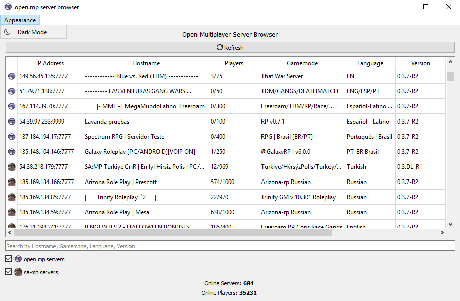
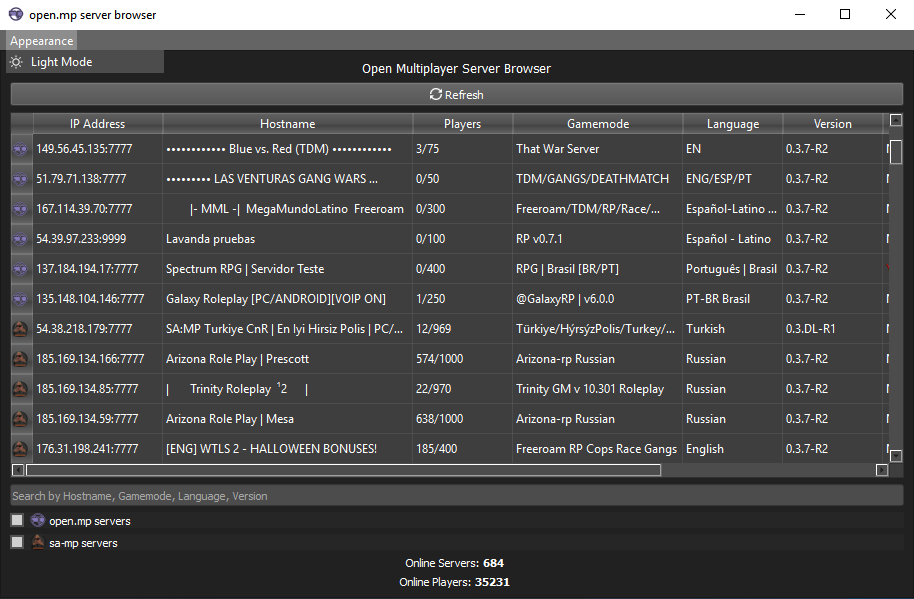

# open.mp Server Browser
open.mp server browser GUI for Desktop (unofficial)

Servers are provided from [open.mp/servers](https://www.open.mp/servers)

<kbd></kbd>

<kbd></kbd>

## Version 1.1.0
- Dark Mode theme

### Download
- [Windows 7 and higher](https://github.com/adib-yg/openmp-server-browser/releases/download/v1.1.0/omp-server-browser.exe)

## Version 1.0.0
- You can copy the server address by clicking on the row
- Refreshing server list (Available every 30 seconds)
- Search and filter rows

### Download
- [Windows 7 and higher](https://github.com/adib-yg/openmp-server-browser/releases/download/v1.0.0/omp-server-browser.exe)

## Development
Fork the repository and build the executable with github actions.

Or to build on your machine:
  - Install Python 3.8.2 (old version for program compatibility with Windows 7)
  - Open CMD or Windows PowerShell
  - Install dependencies
  ```shell
    python -m pip install -r requirements.txt PyInstaller
  ```
  - Build
  ```shell
    PyInstaller main.spec
  ```

The executable file goes to the `./dist` folder.
